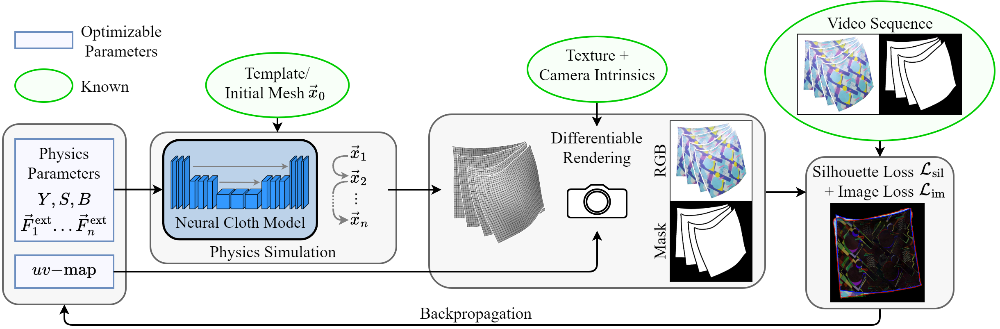

<p align="center">
  <h1 align="center">Physics-guided Shape-from-Template: <br> Monocular Video Perception through Neural Surrogate Models</h1>
  <h3 align="center"> David Stotko · Nils Wandel · Reinhard Klein <br> University of Bonn </h3>
  <h3 align="center">CVPR 2024</h3>
  <h3 align="center"> <a href="https://openaccess.thecvf.com/content/CVPR2024/html/Stotko_Physics-guided_Shape-from-Template_Monocular_Video_Perception_through_Neural_Surrogate_Models_CVPR_2024_paper.html">CVPR Paper</a> &nbsp; | &nbsp; <a href="https://cg.cs.uni-bonn.de/publication/stotko2024-Physics-guided-SfT">Project Page</a> &nbsp; | &nbsp; <a href="https://www.youtube.com/watch?v=o0qs_oip7F4">Video</a> &nbsp; | &nbsp; <a href="https://arxiv.org/abs/2311.12796">arXiv</a> </h3>
  <div align="center"></div>
</p>


<!-- <p align="center"> -->
This repository contains our source code of the paper "Physics-guided Shape-from-Template: Monocular Video Perception through Neural Surrogate Models".
<!-- </p> -->

## Abstract

3D reconstruction of dynamic scenes is a long-standing problem in computer graphics and increasingly difficult the less information is available.
Shape-from-Template (SfT) methods aim to reconstruct a template-based geometry from RGB images or video sequences, often leveraging just a single monocular camera without depth information, such as regular smartphone recordings.
Unfortunately, existing reconstruction methods are either unphysical and noisy or slow in optimization.
To solve this problem, we propose a novel SfT reconstruction algorithm for cloth using a pre-trained neural surrogate model that is fast to evaluate, stable, and produces smooth reconstructions due to a regularizing physics simulation.
Differentiable rendering of the simulated mesh enables pixel-wise comparisons between the reconstruction and a target video sequence that can be used for a gradient-based optimization procedure to extract not only shape information but also physical parameters such as stretching, shearing, or bending stiffness of the cloth.
This allows to retain a precise, stable, and smooth reconstructed geometry while reducing the runtime by a factor of 400–500 compared to $\phi$-SfT, a state-of-the-art physics-based SfT approach.



## Prerequisites

To install the necessary dependencies, you can use the provided environment file.
Note that the environment is written for CUDA 12.1.
Please change the environment file according to your CUDA version or install CUDA 12.1.
```
conda env create --name physics-guided_SfT --file=environment.yml
```

## Usage

To perform a 3D reconstruction, the method needs to be provided with a $32 \times 32$ grid mesh (obj file) of the first frame with sorted vertices and uv-coordinates, a corresponding texture file, as well as RGB and mask image files of the video sequence.
All paths and additional information about camera properties are listed in a ```json``` file that is given as a command line argument to the program.
Moreover, you need to provide a neural network which can be downloaded from [Hugging Face](https://huggingface.co/WestAI-SC/Physics-guided-Shape-from-Template), [Sciebo](https://uni-bonn.sciebo.de/s/GTKeqlmTcWWqmoy) or you can train one yourself as described in the [section](#training-a-network) below.
Make sure to move the network file into the lowest subdirectory of ```./code/logger```.

This method was evaluated on the [ϕ-SfT](https://4dqv.mpi-inf.mpg.de/phi-SfT/) real dataset and corresponding option files are given in ```./code/scenes/```.
To reproduce the results, make sure to download the dataset, create a $32 \times 32$ template mesh grid with the properties described above (note that the cloth is always held at the two corner vertices with indices 0 and 992) and set the paths in the ```json``` scene files.
Pytorch files with sample points on the ground truth surface need to be provided for evaluation.
The reconstruction quality heavily depends on the template and results might deviate significantly.
In order to evaluate all scenes at once, run the command:
``` bash
cd code
python main.py --json=[scenes/R1.json,scenes/R2.json,scenes/R3.json,scenes/R4.json,scenes/R5.json,scenes/R6.json,scenes/R7.json,scenes/R8.json,scenes/R9.json] --evaluate=False --net=SMP_param_a_gated3 --load_index=network
```
There are four command line argument:
- ```--json``` provides a list of all scenes to evaluate
- ```--evaluate``` do evaluate against ground truth point cloud during reconstruction (track quality over iterations)
- ```--net``` determines the network architecture
- ```--load_index``` determindes which network file to load (given in subdirectories of ```./code/logger```)

## Training a network

For training a new cloth network, navigate into the ```./network``` directory and start the training script from there via the command

``` bash
cd network
python train.py --clip_grad_value=1 --max_stretching=5000 --min_stretching=100 --max_shearing=20 --min_shearing=0.05 --max_bending=1 --min_bending=0.001 --lr=0.001 --dataset_size=5000 --batch_size=300 --g=0.125 --net=SMP_param_a_gated3
```

You can vary the parameter ranges for stretching, shearing and bending as well as other training parameters.
More information is given in [README.md](./network/README.md) or in [./network/get_param.py](./network/get_param.py).
The network states will be saved in the subdirectories of ```./network/logger```.
Note that the results might vary for each run.

## Citation

If you use this code for your project, please cite the following publication:
```
@InProceedings{Stotko_2024_CVPR,
    author    = {Stotko, David and Wandel, Nils and Klein, Reinhard},
    title     = {Physics-guided Shape-from-Template: Monocular Video Perception through Neural Surrogate Models},
    booktitle = {Proceedings of the IEEE/CVF Conference on Computer Vision and Pattern Recognition (CVPR)},
    month     = {June},
    year      = {2024},
    pages     = {11895-11904}
}
```

## License

This software is provided under MIT license. See [LICENSE](LICENSE) for more information.

## Acknowledgements

This work has been funded by the DFG project KL 1142/11-2 (DFG Research Unit FOR 2535 Anticipating Human Behavior), by the Federal Ministry of Education and Research of Germany and the state of North-Rhine Westphalia as part of the Lamarr-Institute for Machine Learning and Artificial Intelligence and the InVirtuo 4.0 project, and additionally by the Federal Ministry of Education and Research under grant no. 01IS22094E WEST-AI.